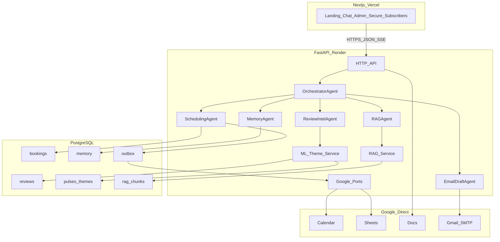

# ARCHITECTURE.md — Investor Ops & Intelligence Suite

**Status:** Engineering design (Phase 0)  
**Owner:** Engineering (Cursor)  
**Audience:** PM, reviewers, future maintainers  

This document is the technical counterpart to [Brain.md](Brain.md) and [PRD.md](PRD.md). It records stack choices, system design, APIs, multi-agent behavior, ML pipeline, persistence guarantees, repo layout, and how implementation maps to [DEVELOPMENT_PLAN.md](DEVELOPMENT_PLAN.md).

---

## 1. Executive summary

We are building a **unified** fintech ops product: **agentic RAG** (Groww + SEBI), **ML-driven review intelligence** (Play Store → themes → pulse), and **IST-aware advisor scheduling** with **Google Calendar / Sheets / Docs / Gmail**, exposed through one persona (**Finn**) and one customer UI, plus an **unauthenticated admin** surface for pulse, bookings, and analytics.

**Implementation shape:** **Next.js (TypeScript)** on **Vercel** (customer + admin + secure + subscriber pages) talking to a **Python FastAPI** service on **Render** (agents, RAG, ML jobs, integrations, persistence).

**Non-negotiables from Brain/PRD preserved here:** real multi-agent orchestration (reason → tool → evaluate → re-plan), ML clustering **before** LLM theme labeling, ML intent only as **hint** to the orchestrator, **visible agent traces** in the UI, **direct Google APIs** behind swappable ports (MCP-ready), **token discipline**, and **subsystem isolation** with documented fallbacks.

---

## 2. Tech stack and rationale

| Layer | Choice | Rationale |
|--------|--------|-----------|
| **UI** | Next.js 14+ (App Router), TypeScript, Vercel | First-class routing for `/`, `/chat`, `/admin`, `/secure/[bookingCode]`, `/subscribers`; simple env to backend URL; matches [UI_UX_SPEC.md](UI_UX_SPEC.md) (light, card-based, distinct from prior projects). |
| **API & orchestration** | FastAPI, Python 3.11+, Render | Single language for **CPU ML** (scikit-learn), **scraping**, **Google official clients**, and **LLM tool loops**; avoids split Node/Python operational overhead on a 3-day timeline. |
| **Primary LLM** | Groq (OpenAI-compatible chat + tools) | Free tier, fast inference; tool-calling models suitable for per-agent loops. |
| **Fallback LLM** | Gemini 3.1 Flash-Lite (API) | Required by [Brain.md](Brain.md); wrapped in a single `LLMClient` with automatic failover. |
| **Embeddings** | `sentence-transformers` (e.g. `all-MiniLM-L6-v2`) on CPU | No paid embedding API; dataset size is small (fund facts + SEBI + thousands of reviews). Model weights cached on disk where the platform allows (see persistence). |
| **Transactional + analytics + memory** | **PostgreSQL** (managed) | **Durable across process restarts and redeployments** (see §8). |
| **Vector search** | **pgvector** in the same PostgreSQL (preferred) | Vectors survive redeploys with the database. If `pgvector` is unavailable in a given environment, fallback is **rebuild index** from `rag_chunks` text rows in Postgres (slower cold start, no data loss for **facts**). |
| **Charts (admin)** | Recharts (or equivalent) | Four graphs with range filters per [PRD.md](PRD.md) §9. |
| **Voice** | Web Speech API in browser only | Per [PRD.md](PRD.md) §7; same `/api/chat` contract. |
| **Email “briefing card”** | Server-rendered image (HTML/CSS → PNG via Playwright or layered Pillow) + multipart MIME | Satisfies image-based advisor email; tradeoff documented in §6.5. |
| **Local development** | Docker Compose optional: `postgres:16` + app | Parity with production persistence model. |

---

## 3. Persistence, durability, and data-loss mitigation

### 3.1 Product requirement (confirmed)

The following **must persist** across **application restarts** and **code redeployments**:

1. **Booking data** — codes, topics, IST slots, advisor assignment, status lifecycle, secure-page completion flags, email draft/send status (mirrored from Sheets where applicable).  
2. **Review history** — raw reviews (or normalized rows), fetch timestamps, linkage to pulses, theme time series for analytics.  
3. **User memory** — session/thread summaries, returning-user profile (non-PII), cross-channel continuity metadata.

**Google Sheets** (and Calendar) are **integration targets** and team-visible sources of truth, but the web service filesystem on typical PaaS **web instances is not durable**. Relying on **SQLite files** or **on-disk Chroma** **only** on Render’s default web disk **risks total loss** on redeploy or instance replacement.

### 3.2 Architecture decision: PostgreSQL as system of record

| Data class | Primary store | Notes |
|------------|---------------|--------|
| Bookings | `bookings` table in **PostgreSQL** | Every confirmed/rescheduled/cancelled/waitlisted event is written here **before** or **together with** Google side effects; Google failures still leave a durable row ([PRD.md](PRD.md) §16). |
| Reviews | `reviews` (+ optional `review_fetch_runs`) | Idempotent upsert by `(source, external_review_id)` or hash of `(date, text)` if IDs missing. |
| Pulses & theme history | `pulses`, `pulse_themes` | Supports admin graphs and Finn greeting context. |
| Memory | `user_profiles`, `memory_events` (or JSON blob per user key) | **No PII**; scrub before write ([PRD.md](PRD.md) §8, §11). |
| RAG chunks | `rag_chunks` (text + metadata + `source_url`) | Always rebuildable from stored text; optional `embedding vector` column if **pgvector** enabled. |
| Subscribers | `subscribers` | Admin recipient selection. |
| Chat / FAQ analytics | `chat_events` (anonymized topic tags) | Feeds FAQ topic graph. |

**Google Sheets/Calendar** remain required for the product story; the backend uses an **outbox or dual-write pattern**: persist locally first (or in same transaction as outbox row), then call Google; on failure, **retry** from outbox ([PRD.md](PRD.md) §16).

### 3.3 Risks and mitigations (explicit)

| Risk | Mitigation |
|------|------------|
| **Ephemeral web disk** (lost on redeploy) | Do **not** rely on SQLite/Chroma files on the web instance for production truth. Use **managed Postgres** (`DATABASE_URL`). |
| **Embedding model cache** lost | Re-download weights on cold start (acceptable) **or** bake into container image; **no user data** in model cache. |
| **pgvector** extension missing | Store `rag_chunks` without vectors; **batch re-embed** on startup or on admin “reindex” action; RAG still answers with higher latency until complete; **keyword/BM25 fallback** per [Brain.md](Brain.md). |
| **Google is authoritative for ops** but DB is authoritative for **app** | Periodic **reconciliation job** (optional): list Sheet rows vs `bookings` and flag drift for admin. |
| **Accidental `DROP DATABASE`** | Managed provider backups (enable on Render Postgres); document RPO expectations for demo vs production. |

### 3.4 Local development

- Developers may use **SQLite** for speed **only** if `.env` explicitly sets `DATABASE_URL=sqlite+aiosqlite:///./local.db` and understands **SQLite files must not be assumed portable to production**.  
- **Recommendation:** use **Docker Postgres** locally with the same schema as production to avoid drift.

---

## 4. System architecture and data flow



**Chat path:** Client sends `message`, `session_id`, `display_name`, optional `client_booking_hint` → FastAPI loads **memory snapshot** + **latest pulse summary** from Postgres → orchestrator coordinates specialists → response streams **assistant text** + **structured agent trace** for the UI panel.

**Pulse path (admin):** Refresh reviews → upsert `reviews` → generate pulse → ML clusters → LLM labels → insert `pulses` / `pulse_themes` → charts read from these tables.

---

## 5. API design (REST + streaming)

Base URL: `https://<render-service>/` (CORS restricted to Vercel origin).

| Method | Path | Purpose |
|--------|------|---------|
| GET | `/health` | JSON: LLM reachability, DB connectivity, embedder status, Google adapter health, last review fetch time ([PRD.md](PRD.md) §14). |
| POST | `/api/chat` | Main Finn turn; returns **SSE** or **NDJSON** stream: `assistant_delta`, `agent_trace`, `ui_hints` (e.g. confirmation card payload). |
| GET | `/api/pulse/latest` | Latest pulse + top themes for chat sidebar / greeting ([PRD.md](PRD.md) §4.3). |
| POST | `/api/admin/reviews/refresh` | Fetch Play Store reviews or load CSV fallback; persist to `reviews`. |
| POST | `/api/admin/pulse/generate` | Run ML + labeling; persist pulse. |
| POST | `/api/admin/pulse/append-doc` | Append pulse text to master Google Doc ([PRD.md](PRD.md) §4.6). |
| GET | `/api/admin/analytics` | Aggregates for four graphs (query params: `range=day|week|month`). |
| GET | `/api/bookings/{code}` | Secure page: non-sensitive booking summary. |
| POST | `/api/bookings/{code}/contact` | Validated contact + consent; update DB + Sheets columns K/L via port. |
| POST | `/api/subscribers` | Subscribe work email. |
| POST | `/api/admin/emails/advisor/preview` | Render PNG + metadata for HITL. |
| POST | `/api/admin/emails/advisor/send` | Send after explicit admin action ([PRD.md](PRD.md) §4.5). |
| POST | `/api/admin/emails/pulse/send` | Multiselect subscribers ([PRD.md](PRD.md) §4.6). |

**Authentication:** None on `/admin` for reviewer access per [Brain.md](Brain.md); still **no secrets** in browser and **rate limiting** recommended on expensive endpoints (refresh reviews, reindex) to reduce abuse cost.

---

## 6. Agent design

### 6.1 Why multiple agents (not one mega-prompt)

- **Separation of concerns:** RAG retrieval strategy vs IST scheduling rules vs email assembly have different tool sets and safety constraints.  
- **Failure isolation:** RAG outage must not break scheduling ([Brain.md](Brain.md)).  
- **Token budget:** Each agent gets a **minimal system prompt** and only its tools in context.  
- **Demonstrability:** Traces show **which** agent reasoned and **which** tools ran ([PRD.md](PRD.md) §5.3).

### 6.2 Agents and responsibilities

| Agent | Role | Representative tools | Evaluate / re-plan |
|-------|------|----------------------|--------------------|
| **Orchestrator** | Interprets turn in context of memory + pulse + optional ML intent **hint**; sequences specialists; enforces Finn persona (IST, no advice, no PII). | `invoke_rag`, `invoke_scheduling`, `get_pulse_summary`, `get_memory_context`, `get_intent_hint` | Re-invokes or changes order if specialist returns `needs_clarification` or `out_of_scope`. |
| **RAG** | Plans Layer 1 vs Layer 2 retrieval; decomposes; retrieves; checks sufficiency; retries with refined queries; emits **Sources:** lines ([PRD.md](PRD.md) §4.1). | `vector_search`, `lexical_search`, `list_covered_funds` | If low confidence → structured escalation (advisor offer), not hallucination ([SCRIPT_FLOW.md](SCRIPT_FLOW.md)). |
| **Scheduling** | Five intents; business rules enforced **deterministically** in code with LLM only for natural language slot extraction. | `parse_preference`, `propose_slots`, `commit_booking`, `google_sync` (wrapped) | Code validates IST/weekday/window; rejects illegal slots even if LLM suggests them ([EDGE_CASES_CHECKLIST.md](EDGE_CASES_CHECKLIST.md) Cat 1–2). |
| **Review intelligence** | Surfaces theme context to orchestrator; admin batch entry for pulse generation. | `fetch_reviews`, `run_clustering`, `save_pulse` | On ML failure → LLM-only theme path ([PRD.md](PRD.md) §16). |
| **Email drafting** | Builds three-section advisor/pulse content; HITL assistance: completeness, anomalies, suggested edits ([PRD.md](PRD.md) §4.4). | `load_booking`, `load_concern_summary`, `load_pulse`, `render_briefing_image` | Flags anomalies (e.g. past date) instead of silent “fixes”. |
| **Memory** | Post-turn extraction; returning user bootstrap; **PII-stripped** ([PRD.md](PRD.md) §8). | `load_profile`, `append_memory`, `summarize_thread` | If DB unavailable → no-op, no user-visible error ([Brain.md](Brain.md)). |

### 6.3 ML intent hint (not a router)

Optional **TF–IDF + logistic regression** (small hand-labeled set) or embedding-centroid similarity produces **probabilities** passed to the orchestrator as **context text**. The orchestrator **may override** ([Brain.md](Brain.md)).

### 6.4 UI trace contract (agent activity panel)

Each user turn emits an array of trace objects, e.g.:

```json
{
  "turn_id": "uuid",
  "steps": [
    {
      "agent": "orchestrator",
      "reasoning_brief": "User asked about exit load and charges; likely needs Groww + SEBI.",
      "tools": [{"name": "invoke_rag", "args_summary": "..."}],
      "replanned": false,
      "outcome": "delegated_rag"
    },
    {
      "agent": "rag",
      "reasoning_brief": "First retrieval shallow on SEBI; reformulating query.",
      "tools": [{"name": "vector_search", "args_summary": "layer=sebi, k=4"}],
      "replanned": true,
      "outcome": "answer_ready"
    }
  ]
}
```

The frontend maps `agent` → color per [UI_UX_SPEC.md](UI_UX_SPEC.md) §2.1.

---

## 7. ML pipeline (theme detection)

### 7.1 Algorithm

1. **Embed** each review (same encoder as RAG for consistency of space).  
2. **Cluster** with **MiniBatchKMeans** (or KMeans) for k in a small range (e.g. 3–8).  
3. **Select k** using **silhouette score** (and/or Davies–Bouldin) on a subsample if needed for CPU time.  
4. **LLM** receives only **representative snippets per cluster** to assign **theme titles** and pick **one redacted quote** per top-3 clusters ([PRD.md](PRD.md) §4.3).

### 7.2 Justification

- **Reproducible** (fixed seeds), **cheap** on CPU, **measurable** (silhouette), and **distinct from LLM-only** “theme guessing” ([EVAL_CRITERIA.md](EVAL_CRITERIA.md) §4).  
- LLM token use is **bounded** to labeling, not grouping.

### 7.3 Fallback

If clustering fails thresholds or errors: **LLM-only** extraction on a stratified sample of reviews; mark pulse metadata `mode=llm_fallback` for honesty in eval reports ([Brain.md](Brain.md)).

---

## 8. RAG pipeline (concise)

- **Ingest:** 15 Groww + 9 SEBI URLs ([PRD.md](PRD.md) §3); clean HTML; chunk with metadata `{layer, source_url, fund_slug?, topic_tag?}`; upsert `rag_chunks`; embed and store vector if pgvector enabled.  
- **Query:** Orchestrator/RAG chooses layers; retrieve small **k**; optional metadata filter when fund is identified; **evaluate** chunk relevance with a light model pass or heuristic; **retry** with refined query if insufficient.  
- **Fallback:** Embedding outage → **lexical** search over `rag_chunks` ([Brain.md](Brain.md)).

---

## 9. Google integration layer (MCP-ready)

Define **ports** (Python Protocols or abstract base classes):

- `CalendarPort` — create/update/delete tentative holds.  
- `SheetsPort` — append/update rows per [PRD.md](PRD.md) §6.1.  
- `GmailPort` — send MIME messages via SMTP (app password) per [PRD.md](PRD.md) §6.3.  
- `DocsPort` — append pulse to master doc.

**Adapter:** `GoogleApiAdapter` using service account JSON + SMTP env. **Future:** `McpGoogleAdapter` implementing the same ports without changing scheduling/email **domain services** ([Brain.md](Brain.md) Integration Approach).

---

## 10. Email briefing images

**Pipeline:** Jinja2 (or similar) HTML template for the three sections → render to PNG → attach to email; plain-text alt body for accessibility.  

**Implementation choice:** Prefer **Playwright** headless if Render memory allows; otherwise **Pillow**-composed card. Document measured cold-start impact in [HEALTH.md](HEALTH.md) after Phase 6.

---

## 11. Voice, memory, and identity

- **Voice:** Client captures audio → Web Speech **recognition** → text to `/api/chat`; response text → **speechSynthesis**; mic states per [UI_UX_SPEC.md](UI_UX_SPEC.md); failure → banner + text-only ([PRD.md](PRD.md) §7).  
- **Identity:** `session_id` (UUID in `localStorage`) + `display_name` from landing; optional booking code for secure flow; **no PII in chat** ([PRD.md](PRD.md) §8.4).  
- **Cross-channel:** Same `session_id` and backend memory records regardless of voice or text input modality.

---

## 12. Security (architecture-level)

- Secrets only via environment variables ([Brain.md](Brain.md)).  
- **PII:** blocklist + model refusal patterns; strip before memory persistence.  
- **Injection:** input sanitation; system prompts not disclosed ([PRD.md](PRD.md) §11).  
- **Admin:** open by product decision; still no service account JSON or LLM keys in frontend bundles.

---

## 13. Repository layout

```
/
  ARCHITECTURE.md
  Brain.md
  PRD.md
  ... (other PM docs)
  README.md
  .env.example
  .gitignore
  docker-compose.yml          # local Postgres (durable dev parity; see §3.4)
  frontend/                   # Next.js → Vercel
    app/
    components/
    lib/
    public/
  backend/                    # FastAPI → Render
    app/
      main.py
      api/
      agents/
      integrations/
        google/
        ports.py
      rag/
      ml/
      db/
        models.py
        migrations/           # Alembic recommended
      services/
      schemas/
    scripts/
      ingest_funds.py
      eval_rag.py
    tests/
  data/                       # gitignored: CSV fallbacks, scratch
```

---

## 14. Mapping to development phases

| Phase | Engineering focus |
|-------|-------------------|
| 0 | This document; `.env.example`; `.gitignore`; optional Compose. |
| 1 | Next.js route shells; FastAPI `/health`; Vercel + Render deploy; CORS. |
| 2 | Ingestion scripts; `rag_chunks` + embeddings; review ingest to `reviews`. |
| 3 | ML service; `pulses` / `pulse_themes`; metrics for eval. |
| 4 | All agents; streaming `/api/chat`; LLM fallback; traces. |
| 5 | Chat UI + agent panel consuming traces ([UI_UX_SPEC.md](UI_UX_SPEC.md)). |
| 6 | Google ports; outbox/dual-write; advisor email draft pipeline. |
| 7 | Voice client integration. |
| 8 | Admin dashboard + analytics queries + pulse UI. |
| 9 | Memory tables + orchestrator hydration + returning user UX. |
| 10 | Secure + subscriber flows wired to API + Sheets. |
| 11 | Edge cases ([EDGE_CASES_CHECKLIST.md](EDGE_CASES_CHECKLIST.md)); evals ([EVAL_CRITERIA.md](EVAL_CRITERIA.md)). |
| 12 | README, source manifest 30+ URLs, demo, eval report. |

---

## 15. Open decisions (minor, safe to defer until implementation)

- Exact **Groq model** string per tool-calling quality at build time.  
- **Playwright vs Pillow** for email PNG based on Render memory envelope.  
- Whether **intent hint** ships in Phase 4 or Phase 11 (nice-to-have vs eval story).

---

*End of ARCHITECTURE.md — ready for build after PM sign-off per [Brain.md](Brain.md).*
